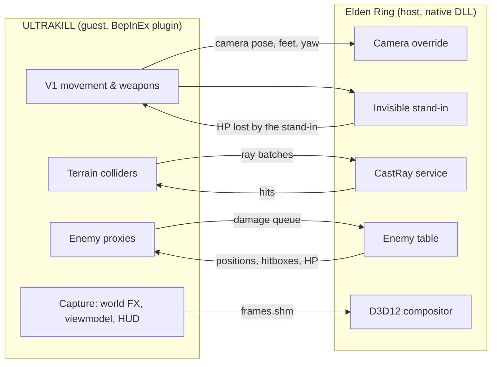

# UltraRing

**ULTRAKILL's V1 in the Lands Between — both games running at once.**

[](#requirements)
[](#requirements)
[](#requirements)
[](CHANGELOG.md)
[](LICENSE)

UltraRing runs real ULTRAKILL alongside real Elden Ring. ULTRAKILL handles the player: V1's movement,
dashes, slides, slams, wall jumps, every weapon, the whiplash, parries and the HUD. Elden Ring keeps its
own world, enemies, bosses, items and saves, and draws the final image with V1's arm, gun and HUD
composited into it. Both games stay open for the whole session.

> **The ULTRAKILL side lives in [ULTRAKILL Crossover Bridge](https://github.com/Themetralla3000/ultrakill-crossover-bridge)** (guest plugin, protocol, host SDK, fake host), so anyone can put V1 into other games. UltraRing is the Elden Ring host integration: Minecraft Ring's host DLLs, plus the install/launch/restore tooling for Elden Ring. The kit is a git submodule (`bridge/`).

### Built on Minecraft Ring

UltraRing exists thanks to [**Minecraft Ring**](https://github.com/siddoff/Minecraft-Ring) by siddoff (Minecraft
running inside Elden Ring), itself based on
[**minecraft-crossover-bridge**](https://github.com/justbustin/minecraft-crossover-bridge) by justbustin.
**A large part of UltraRing is their code:**

- the entire Elden Ring side — the native DLLs that hook the game (camera override, invisible stand-in, terrain
  raycasts, enemy table, damage, interactions, D3D12 compositor) — is compiled **unchanged** from Minecraft Ring's
  source;
- the shared-memory protocol is a C# transcription of their `bridge_protocol.h`;
- the install/launch/restore scripts and the guest-side design (recalls, shared life, F8, input window, frame
  passthrough) are adapted from theirs.

The ULTRAKILL side (plugging V1 in where Minecraft used to be) now lives in the [ULTRAKILL Crossover Bridge](https://github.com/Themetralla3000/ultrakill-crossover-bridge). All three projects are MIT
licensed; their notices are kept in [THIRD_PARTY_NOTICES.md](THIRD_PARTY_NOTICES.md).

> **Experimental and vibe-coded.** This project was built with AI in a simple feedback loop: describe the goal,
> let the code be written, try it in game, report what breaks, repeat. It has only been tried in a few places,
> so expect rough edges. Offline single-player only.

## What works

| Area | Behaviour |
| --- | --- |
| **Camera** | Elden Ring renders from V1's eyes every frame: position, look direction, roll and V1's field of view. |
| **Movement** | All of ULTRAKILL's movement on Elden Ring ground: walk, slide, dash (with its i-frames), jump, ground slam, slide-jump, wall jumps. 1 ULTRAKILL unit = 0.5 m, so V1 is 1.75 m tall, like the Tarnished. |
| **Terrain** | Elden Ring's collision is sampled with the game's own raycasts around V1 and rebuilt as invisible ULTRAKILL colliders: floors, slopes, stairs, walls (knee/chest/head probes), ceilings. Sampling looks ahead of V1's velocity, and every zone you visit is cached on disk so revisited areas have collision instantly. |
| **Stand-in** | The Tarnished stays in the world as an invisible stand-in pinned to V1's feet and facing. Enemies aggro and attack it as usual; it never dies on its own and its HP loss is forwarded to V1. |
| **Weapons** | Revolver (all variants, headshots, coins and ricochets), shotgun, nailgun (nails, saws, magnets), railcannon, rocket launcher, explosions, punches and the ground slam all hit Elden Ring enemies. Every enemy within 80 m gets an invisible ULTRAKILL hitbox with a weak-point head. |
| **Damage out** | ULTRAKILL damage is converted to a share of the enemy's max HP (by default 1 ULTRAKILL health point = 60 Elden Ring HP: a soldier dies to a couple of revolver shots, bosses take a while). Elden Ring plays the hit reactions, deaths, rune drops and kill credit. |
| **Damage in** | When an enemy hits the stand-in, V1 loses the same share of its health (a hit that would take 20 % of the Tarnished's HP takes 20 HP from V1). Dashing through an attack dodges it, exactly as in ULTRAKILL. |
| **Style and blood** | The style meter, freshness, kill streaks and blood healing work on Elden Ring enemies: get close and get bloody to heal. |
| **Parry** | Punch right before an enemy's attack lands: the hit is cancelled, V1 gets the parry flash, full heal and style, and the attacker takes a heavy blow (25 % of its max HP, 8 % for bosses). |
| **Whiplash** | Hooks any Elden Ring enemy and pulls V1 to it (Elden Ring enemies are always "heavy"). |
| **Shared life** | V1 dies, the Tarnished dies (YOU DIED, runes on the ground). The Tarnished dies in Elden Ring (e.g. falling off the map), V1 dies. When Elden Ring respawns you at a Site of Grace, V1 is moved there. |
| **Interactions** | Elden Ring's prompts ("Open", "Pick up", "Touch grace"...) appear on V1's HUD; press **V** to perform them. Doors and levers re-sample the terrain once they move. |
| **Control switch** | **F8** hands camera and controls back to Elden Ring (menus, map, inventory, leveling up, ladders); F8 in Elden Ring returns to V1, who is moved to wherever the Tarnished is. |

## Controls

| Key | Action |
| --- | --- |
| ULTRAKILL's own binds | Movement, weapons, punch (F), whiplash (R), variants (E/Q), slots (1-6)... unchanged |
| **V** | Elden Ring interaction (doors, levers, items, graces, NPCs) |
| **F8** | Switch control between ULTRAKILL and Elden Ring |
| **F9** | Bridge diagnostics on screen |
| **F10** | Show the rebuilt terrain inside Elden Ring (floors green, walls red, ceilings blue) |

The interact and switch keys can be changed in the config ([Configuration](#configuration)).

## Requirements

| Component | Supported setup |
| --- | --- |
| OS | Windows 10/11 x64 |
| Elden Ring | App Ver. **1.17.1** (`eldenring.exe` **2.7.1.0**), Steam. Other builds are refused by the host DLL. |
| ULTRAKILL | Current Steam build (Unity 2022.3). The bridge boots it straight into the sandbox, which it uses as an empty shell. |
| Build tools | .NET 8 SDK, Python 3, git. `tools\Build.ps1` downloads LLVM-MinGW and BepInEx 5.4.23.5 itself; compiling the guest needs ULTRAKILL's installed `Managed` DLLs. |
| Hardware | Enough CPU/GPU/RAM to run both games at the same time. |

You need your own copies of both games. **Offline only:** the launcher starts `eldenring.exe` directly, without
Easy Anti-Cheat, and the host DLL refuses to activate if EAC is present. Never take a modded Elden Ring online.

## Getting started

All commands run in PowerShell from the repository root.

```powershell
git clone --recursive https://github.com/Themetralla3000/UltraRing.git
cd UltraRing
# cloned without --recursive?  git submodule update --init
powershell -ExecutionPolicy Bypass -File tools\Build.ps1   # host DLLs + staged guest (bridge\dist\guest)
powershell -ExecutionPolicy Bypass -File .\Install.ps1     # close both games first
.\start.bat                                                # or: powershell -File .\Launch.ps1
```

1. **Build** fetches the pinned Minecraft Ring source and the toolchains if missing, builds the Elden Ring host
   DLLs, then calls the kit's `bridge\scripts\Build.ps1` to build the ULTRAKILL guest and stage BepInEx + the plugin under `bridge\dist\guest\`. Upgrading from 0.2.0: your old plugin config is copied to the new name once.
2. **Install** (defaults to the Steam paths; override with `-EldenRingDir` / `-UltrakillDir`):
   - Elden Ring: backs up your saves (`%APPDATA%\EldenRing`) and moves conflicting mods (Seamless Coop, ReShade,
     other `dinput8.dll` mods...) into `backups\<timestamp>`, then copies the bridge DLLs and `steam_appid.txt`.
   - ULTRAKILL (through the kit's `Install-Guest.ps1`): only adds BepInEx's `winhttp.dll` with a **disabled** `doorstop_config.ini`; launching ULTRAKILL
     from Steam stays vanilla. The bridge enables BepInEx through command-line arguments only.
3. **Launch**: starts Elden Ring with the bridge (switching it to borderless window mode, which the input overlay
   needs), waits for the host DLL, then starts ULTRAKILL. In Elden Ring choose **Continue**. When the Tarnished is
   in the world, V1 appears at its position and takes over.
4. **Stop** (`.\Stop.bat`): closes ULTRAKILL cleanly and gives Elden Ring its camera and character back
   (`-All` closes Elden Ring too). Use it if ULTRAKILL crashed and Elden Ring still shows V1's last frame.
5. **Restore** (`.\Restore.ps1`): removes the bridge from both game folders and puts back everything Install moved
   (Seamless Coop included). Saves are never deleted or overwritten.

Lost the focus after Alt+Tab? Click the middle of the game, or run `Focus.bat`. After a crash or a killed ULTRAKILL, run `Stop.bat` (closes ULTRAKILL, releases Elden Ring; `Stop.bat -All` also closes Elden Ring).

## How it works

UltraRing follows the architecture of [Minecraft Ring](https://github.com/siddoff/Minecraft-Ring): two complete
games connected through shared memory, one owning the player and the other owning the world.



| Role | Game | Responsibilities |
| --- | --- | --- |
| Host | Elden Ring, with Minecraft Ring's native bridge DLL **unchanged** | World, enemies and saves; camera override; hidden stand-in that takes enemy hits; terrain ray queries; enemy table and damage application; interactions; D3D12 compositing with depth and relighting |
| Guest | ULTRAKILL, with the [ULTRAKILL Crossover Bridge](https://github.com/Themetralla3000/ultrakill-crossover-bridge) BepInEx plugin (`bridge/`) | V1 and its weapons; invisible colliders rebuilt from host rays; one hittable proxy per host enemy; frame capture; the input window glued over Elden Ring |

The guest speaks the exact `bridge_protocol.h` layout of Minecraft Ring's Fabric mod, so the Elden Ring side needs
no changes at all. Per frame the guest:

1. reads Elden Ring's state (zone, stand-in position, window, life) from `bridge.shm`;
2. lets ULTRAKILL simulate V1 against the colliders built from earlier ray batches, and submits new rays;
3. mirrors Elden Ring's enemy table into proxies and queues the damage V1 dealt;
4. renders V1's layers (world effects, viewmodel, HUD) with its own cameras into `frames.shm`;
5. publishes the camera pose and the stand-in pose for that frame, which Elden Ring applies and composites.

ULTRAKILL's window sits on top of Elden Ring's, borderless and 99.6 % transparent, so it owns the keyboard and mouse
while you only see Elden Ring.

## Configuration

`bridge\dist\guest\BepInEx\config\dev.ukbridge.guest.cfg` (created on the first run; `Build.ps1` restages that folder, so copy the file aside if you want to keep edits across rebuilds):

| Section | Key | Default | Meaning |
| --- | --- | --- | --- |
| General | `MetresPerUnit` | 0.5 | Elden Ring metres per ULTRAKILL unit (V1 = 3.5 units). |
| General | `TargetFrameRate` | 120 | ULTRAKILL's frame cap while bridged. |
| Combat | `HostHpPerUkHp` | 60 | Elden Ring HP per point of ULTRAKILL enemy health. Lower = enemies die faster. |
| Combat | `HostDamageScale` | 1 | Multiplier for the damage V1 takes from Elden Ring hits. |
| Combat | `SolidEnemies` | false | Enemies block V1 and can be stood on. |
| Rendering | `InteractKey` / `SwitchKey` | V / F8 | Interaction and control-switch keys. |
| Rendering | `Composite` | true | Draw V1's layers into Elden Ring's frame. |
| Rendering | `CaptureScale` | 1 | Capture resolution factor (lower = faster, blurrier arm/HUD). |
| Rendering | `WindowMode` | Layered | Input window technique: `Layered`, `Region` or `Tiny` (see Troubleshooting). The environment variable `UKBRIDGE_WINDOW_MODE` overrides it. |
| Rendering | `CaptureFlipRows` | false | Flip the captured layers if V1's arm appears upside down. |
| Terrain | `Radius` / `CellSize` | 24 / 0.5 | Sampling radius and resolution in metres. |
| Terrain | `StepHeight` | 0.6 | Height jump (m) between samples that becomes a wall instead of a slope. |
| Terrain | `PersistentCache` | true | Keep sampled terrain per zone in `runtime\terrain-cache`. |
| Debug | `Overlay` | false | Start with the F9 diagnostics shown. |

## Troubleshooting

| Symptom | Fix |
| --- | --- |
| Elden Ring minimises or flickers when V1 takes over | Elden Ring must be in **borderless window** mode (System → Graphics → Screen Mode). The launcher sets it, but an in-game change back to Fullscreen breaks the overlay. |
| Can't get back into the game after Alt+Tab | Click the middle of the screen, or run `Focus.bat`. |
| ULTRAKILL is visible on top of Elden Ring | Set `WindowMode = Region` in the config (or `UKBRIDGE_WINDOW_MODE=Region`). |
| V1's arm/HUD is upside down | Set `CaptureFlipRows = true`. |
| ULTRAKILL crashed and Elden Ring is frozen on its last frame / you can't move the Tarnished | Run `Stop.bat`. |
| V1 falls through a spot or walks through a wall | Press F10 to see the rebuilt terrain there and report it with a screenshot and the logs. |
| Launcher says the bridge did not load | Close Elden Ring, start it only through `start.bat`, check `runtime\er-bridge.log` and the exact Elden Ring version. |

Logs: `runtime\er-bridge.log` (Elden Ring side) and `bridge\dist\guest\BepInEx\LogOutput.log` (ULTRAKILL side).

## Known limitations

- V1's world effects (projectiles, explosions, gore) are drawn on top of Elden Ring without depth occlusion yet,
  so they show through walls. The arm and HUD are unaffected.
- The camera follows the captured frames, so it lags V1 by a frame or two.
- Terrain is sampled, not exact: pillars thinner than ~0.3 m can be missed, and areas with several stacked floors
  keep one floor and one ceiling per 0.5 m column.
- Elden Ring enemies cannot be knocked back, pulled or launched by ULTRAKILL; enemy projectiles exist only in
  Elden Ring, so parries are melee-timed punches.
- Ladders, menus, the map and leveling need Elden Ring's controls (F8).
- Single-player only; Seamless Coop and other Elden Ring DLL mods are moved aside while installed.

## Development

| Path | Contents |
| --- | --- |
| `bridge/` | Git submodule: [ULTRAKILL Crossover Bridge](https://github.com/Themetralla3000/ultrakill-crossover-bridge): guest plugin, protocol (C# and spec), host SDK, fake host and protocol tests. Develop the guest, add hosts or run the fake host there (`bridge\scripts\Run-FakeHost.ps1`; `.\Launch.ps1 -FakeHost` here uses it too). |
| `tools/` | `Build.ps1` (host DLLs + the kit's build), `Stop.ps1`, `Focus.ps1`, shared helpers |
| `Install.ps1`, `Launch.ps1`, `Restore.ps1` | Elden Ring install/launch/restore; the ULTRAKILL part delegates to the kit's `Install-Guest.ps1`, `Launch-Guest.ps1`, `Uninstall-Guest.ps1` |
| `docs/research/` | History: host contract, ULTRAKILL internals, reviews, toolchain notes (current docs are in the kit) |
| `external/` | Pinned Minecraft Ring checkout (`711015a`), fetched by `Build.ps1`, not committed |

## Credits

- [Minecraft Ring](https://github.com/siddoff/Minecraft-Ring) by **siddoff** and
  [minecraft-crossover-bridge](https://github.com/justbustin/minecraft-crossover-bridge) by **justbustin** (MIT):
  the Elden Ring host DLLs, the protocol and the overall design. See [THIRD_PARTY_NOTICES.md](THIRD_PARTY_NOTICES.md).
- [ULTRAKILL Crossover Bridge](https://github.com/Themetralla3000/ultrakill-crossover-bridge) (same author, MIT): the ULTRAKILL guest, protocol and tooling.
- [BepInEx](https://github.com/BepInEx/BepInEx) and HarmonyX for loading and patching ULTRAKILL.

UltraRing is an unofficial fan project, unaffiliated with New Blood Interactive, Arsi "Hakita" Patala,
FromSoftware or Bandai Namco. No game files are distributed. Licensed under the [MIT License](LICENSE).
